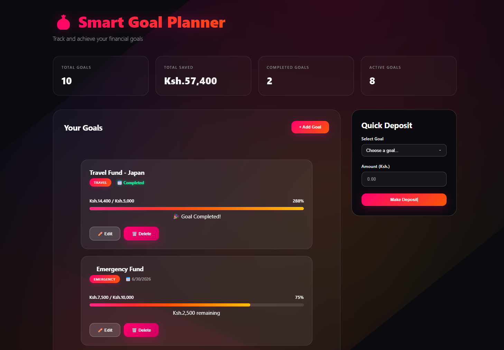

# 🎯 Smart Goal Planner

A modern web application to **plan, track, and achieve your financial goals** with ease.  
Built using **HTML, CSS, JavaScript**, and **JSON Server** for backend simulation.

---

## ✨ Features

- **Add, Edit & Delete Goals** – Easily manage your financial targets.
- **Track Progress** – Visual progress bars with real-time calculations.
- **Quick Deposit** – Instantly update your savings.
- **Category & Deadline Support** – Organize goals effectively.
- **Responsive & Modern UI** – Beautiful design optimized for all devices.

---

## 🛠 Tech Stack

- **Frontend:** HTML5, CSS3, JavaScript (Vanilla)
- **Development Server:** Live Server

---

## 🚀 Getting Started (Local Setup)
